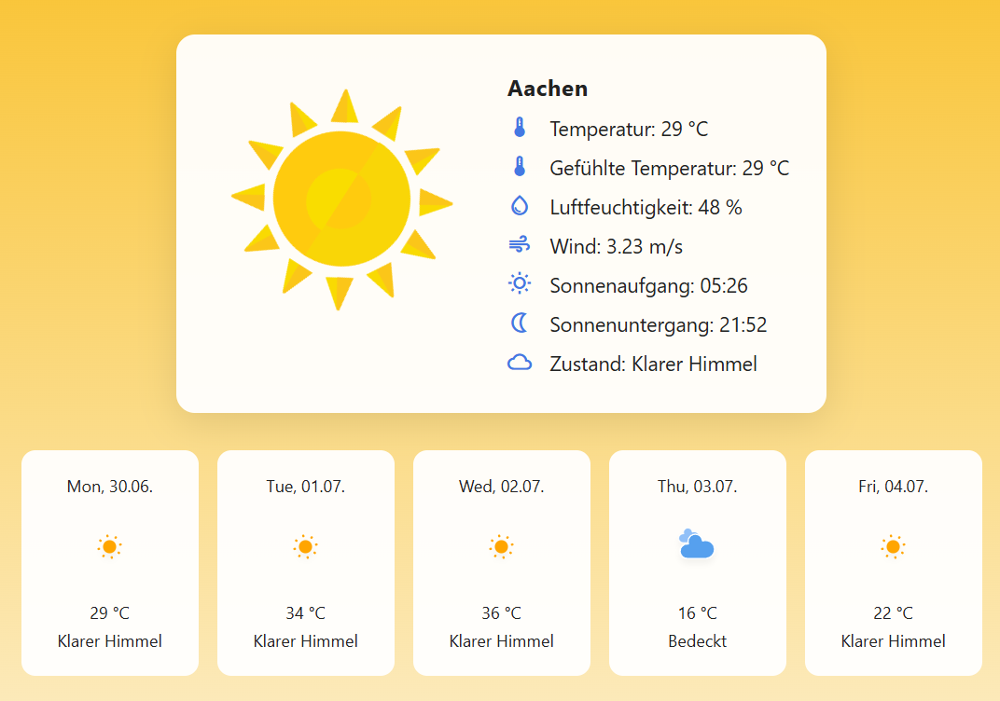

# 📝 Angular v20 Weather-App

Wetter-App mit Echtzeitdaten, LottieAnimationen, 5-Tage Vorhersage und responsive Design 

## 📸 Vorschau 



---

## 🚀 Features
- Live Wetterdaten (OpenWeatherMap API)
- 5-Tages-Vorhersage
- Animierte Wetter-Icons dank [LottieFiles](https://lottiefiles.com/)
- Responsive Design 
- Material Icons
- Standalone Angular 20 + Vite Build

---

## 🛠️ Tech Stack
- Angular 20 (Standalone)
- Vite
- SCSS
- TypeScript
- Lottie/ngx-lottie
- OpenWeatherMap API
- Material Icons

---

## 📦 Projekt starten (lokal)

```bash
git clone https://github.com/MarcelBerlin/weather-app
cd weather-app
npm install
ng serve

---

