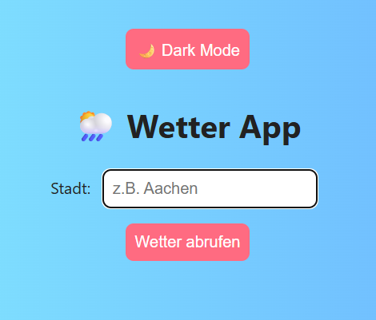

# 📝 Angular Weather-App

Ein kleines Übungsprojekt im Rahmen meiner Angular-Weiterentwicklung.  
Ziel: Deutschlandweite Wetterabfrage mit 5-Tage Vorhersage. Detailierte Informationen über Temperatur, Luftdruck, Feuchtigkeit etc. basierend auf einer API von OpenWeather.com

---

## 🚀 Features
- gewünschte Stadt eingeben
- Aktuelles Wetter inkl. 5-Tage Vorhersage wird angezeigt

---

## 🛠️ Tech Stack
- Angular 20 (Standalone Components)
- TypeScript
- API
- LottieFiles
- SCSS

---

## 📸 Vorschau 




---

## 📦 Projekt starten (lokal)

```bash
git clone https://github.com/MarcelBerlin/weather-app
cd weather-app
npm install
ng serve

---

